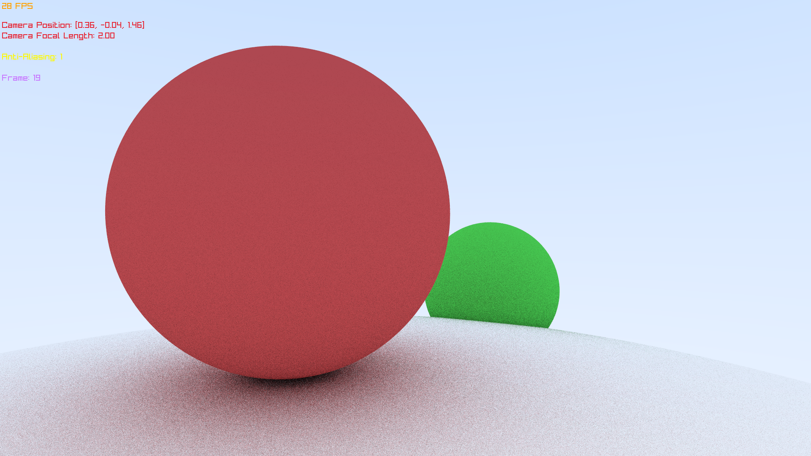

# Simple Raytracer
### _Based on the **Ray Tracing in One Weekend** blog_

This is a basic raytracer I'm working on for the HackClub flavourtown event, built in C using the Raylib library.

This project is currently still in development and I haven't created releases for all platforms and architectures yet **(only Windows arm64)**, however I will release it to more platforms in the future, when I can get a proper pipeline for building the project.

## Controls

### Camera

- **Movement** - WASD

- **Zoom** - Scroll Wheel

### Render Settings

- **Anti-Aliasing Toggle** - '1' key

